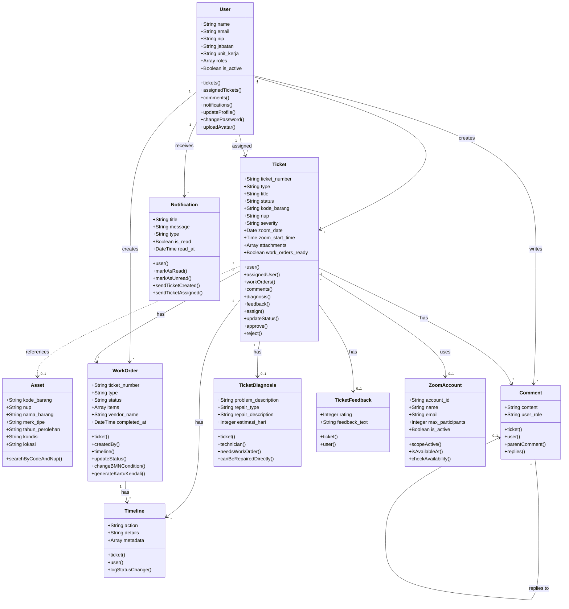

# Class Diagram - BPS NTB Ticketing System

```mermaid
classDiagram
    %% Core Models
    class User {
        +String name
        +String email
        +String nip
        +String jabatan
        +String unit_kerja
        +Array roles
        +Boolean is_active
        +tickets()
        +assignedTickets()
        +comments()
        +notifications()
        +updateProfile()
        +changePassword()
        +uploadAvatar()
    }

    class Ticket {
        +String ticket_number
        +String type
        +String title
        +String status
        +String kode_barang
        +String nup
        +String severity
        +Date zoom_date
        +Time zoom_start_time
        +Array attachments
        +Boolean work_orders_ready
        +user()
        +assignedUser()
        +workOrders()
        +comments()
        +diagnosis()
        +feedback()
        +assign()
        +updateStatus()
        +approve()
        +reject()
    }

    class Asset {
        +String kode_barang
        +String nup
        +String nama_barang
        +String merk_tipe
        +String tahun_perolehan
        +String kondisi
        +String lokasi
        +searchByCodeAndNup()
    }

    class WorkOrder {
        +String ticket_number
        +String type
        +String status
        +Array items
        +String vendor_name
        +DateTime completed_at
        +ticket()
        +createdBy()
        +timeline()
        +updateStatus()
        +changeBMNCondition()
        +generateKartuKendali()
    }

    class Comment {
        +String content
        +String user_role
        +ticket()
        +user()
        +parentComment()
        +replies()
    }

    class TicketDiagnosis {
        +String problem_description
        +String repair_type
        +String repair_description
        +Integer estimasi_hari
        +ticket()
        +technician()
        +needsWorkOrder()
        +canBeRepairedDirectly()
    }

    class TicketFeedback {
        +Integer rating
        +String feedback_text
        +ticket()
        +user()
    }

    class Timeline {
        +String action
        +String details
        +Array metadata
        +ticket()
        +user()
        +logStatusChange()
    }

    class Notification {
        +String title
        +String message
        +String type
        +Boolean is_read
        +DateTime read_at
        +user()
        +markAsRead()
        +markAsUnread()
        +sendTicketCreated()
        +sendTicketAssigned()
    }

    class ZoomAccount {
        +String account_id
        +String name
        +String email
        +Integer max_participants
        +Boolean is_active
        +scopeActive()
        +isAvailableAt()
        +checkAvailability()
    }

    %% Relationships
    User "1" --> "*" Ticket : creates
    User "1" --> "*" Ticket : assigned
    User "1" --> "*" Comment : writes
    User "1" --> "*" Notification : receives
    User "1" --> "*" WorkOrder : creates
    
    Ticket "1" --> "*" WorkOrder : has
    Ticket "1" --> "*" Comment : has
    Ticket "1" --> "0..1" TicketDiagnosis : has
    Ticket "1" --> "0..1" TicketFeedback : has
    Ticket "1" --> "*" Timeline : has
    Ticket "*" --> "0..1" ZoomAccount : uses
    Ticket "*" ..> "0..1" Asset : references
    
    Comment "*" --> "0..1" Comment : replies to
    WorkOrder "1" --> "*" Timeline : has
```
