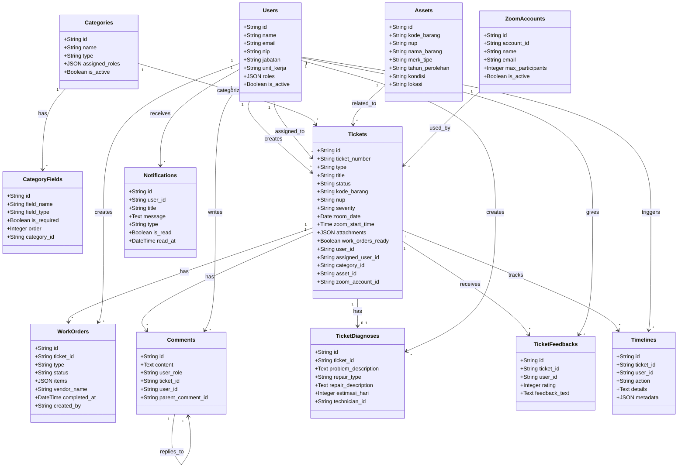

# 🗄️ Database Schema

**Sistem Layanan Internal Terpadu - BPS NTB**  
*Last Updated: 15 Desember 2025*

---

## 📊 Class Diagram



### 📖 Penjelasan Class Diagram

Class diagram menggambarkan model yang dibangun pada aplikasi ini, yaitu:

- **User** merepresentasikan pengguna di aplikasi ini yang dapat memiliki satu atau banyak role (super_admin, admin_layanan, admin_penyedia, teknisi, dan pegawai). User dapat membuat tiket, menerima assignment, memberikan feedback, dan menerima notifikasi.

- **Ticket** merupakan model aplikasi dari ticket perbaikan dan juga layanan zoom. Tiket memiliki status lifecycle (submitted → assigned → in_progress → completed/closed) dan dapat terkait dengan aset, kategori, akun zoom, serta memiliki diagnosis, komentar, dan timeline.

- **Asset** merupakan data BMN/Barang Milik Negara (kode_barang, NUP, kondisi) yang direferensi oleh tiket perbaikan. Setiap aset memiliki informasi lengkap seperti merk/tipe, tahun perolehan, dan lokasi.

- **Category** merupakan kategori tiket dengan tipe yang berbeda (perbaikan, zoom_meeting). Kategori memiliki dynamic fields dan assigned roles yang menentukan siapa yang bisa menangani tiket kategori tersebut.

- **CategoryFields** merupakan field dinamis untuk setiap kategori. Mendukung berbagai tipe input (text, number, date, select) dengan validasi required dan urutan tampilan custom.

- **WorkOrder** merupakan pesanan untuk sparepart/vendor/license yang dibuat ketika tiket memerlukan pengadaan. Work order memiliki status procurement sendiri dan dapat memiliki banyak item.

- **Comment** merupakan model yang menyimpan diskusi dengan threading (parent_comment_id). Mendukung nested replies dan mencatat role user saat berkomentar.

- **TicketDiagnosis** merupakan model hasil diagnosa teknisi yang berisi deskripsi masalah, tipe perbaikan (direct_repair, need_sparepart, need_vendor), dan estimasi waktu pengerjaan.

- **TicketFeedback** menyimpan rating (1-5) & feedback user setelah tiket selesai. Digunakan untuk evaluasi kualitas layanan.

- **Timeline** merupakan model audit log aktivitas tiket. Mencatat setiap perubahan status, assignment, dan aksi penting lainnya dengan metadata lengkap (old_value, new_value).

- **Notification** merupakan model untuk notifikasi real-time kepada user. Mendukung berbagai tipe notifikasi (ticket_created, status_changed, assignment, dll) dengan status read/unread.

- **ZoomAccount** merupakan model akun zoom dengan availability check. Sistem secara otomatis mengalokasikan akun zoom yang available berdasarkan jadwal dan kapasitas max_participants.

**Relasi Antar Model:**
- Users berelasi dengan Tickets (1:N) sebagai creator dan assignee
- Tickets berelasi dengan Assets (N:1) untuk tiket perbaikan
- Tickets berelasi dengan Categories (N:1) untuk klasifikasi
- Tickets berelasi dengan ZoomAccounts (N:1) untuk booking meeting
- Tickets berelasi dengan WorkOrders (1:N) untuk pengadaan
- Tickets berelasi dengan Comments (1:N) untuk diskusi
- Tickets berelasi dengan TicketDiagnosis (1:1) untuk hasil diagnosa
- Tickets berelasi dengan TicketFeedbacks (1:N) untuk evaluasi
- Tickets berelasi dengan Timelines (1:N) untuk audit trail
- Categories berelasi dengan CategoryFields (1:N) untuk dynamic form
- Comments berelasi dengan Comments (1:N) untuk threading
- Users berelasi dengan Notifications (1:N) untuk notifikasi personal

---

## 📋 Tabel Database

### 1. Users
Menyimpan data pengguna sistem dengan multi-role support.

| Kolom | Tipe | Keterangan |
|-------|------|------------|
| id | VARCHAR(255) | Primary key |
| name | VARCHAR(255) | Nama lengkap |
| email | VARCHAR(255) | Email (unique) |
| nip | VARCHAR(255) | Nomor Induk Pegawai |
| jabatan | VARCHAR(255) | Jabatan/posisi |
| unit_kerja | VARCHAR(255) | Unit kerja/divisi |
| roles | JSON | Array roles (admin, teknisi, pegawai, admin_layanan) |
| is_active | BOOLEAN | Status aktif |

---

### 2. Assets
Menyimpan inventori aset BMN (Barang Milik Negara).

| Kolom | Tipe | Keterangan |
|-------|------|------------|
| id | VARCHAR(255) | Primary key |
| kode_barang | VARCHAR(255) | Kode barang BMN |
| nup | VARCHAR(255) | Nomor Urut Pendaftaran |
| nama_barang | VARCHAR(255) | Nama aset |
| merk_tipe | VARCHAR(255) | Merk dan tipe |
| tahun_perolehan | VARCHAR(255) | Tahun pembelian |
| kondisi | VARCHAR(255) | Kondisi: Baik, Rusak Ringan, Rusak Berat |
| lokasi | VARCHAR(255) | Lokasi penempatan |

---

### 3. Categories
Kategori tiket dengan dynamic form fields.

| Kolom | Tipe | Keterangan |
|-------|------|------------|
| id | VARCHAR(255) | Primary key |
| name | VARCHAR(255) | Nama kategori |
| type | VARCHAR(255) | Tipe: perbaikan, zoom_meeting |
| assigned_roles | JSON | Roles yang bisa handle kategori ini |
| is_active | BOOLEAN | Status aktif |

---

### 4. Category Fields
Field dinamis untuk setiap kategori tiket.

| Kolom | Tipe | Keterangan |
|-------|------|------------|
| id | VARCHAR(255) | Primary key |
| field_name | VARCHAR(255) | Nama field |
| field_type | VARCHAR(255) | Tipe: text, number, date, select, dll |
| is_required | BOOLEAN | Wajib diisi atau tidak |
| order | INTEGER | Urutan tampilan |
| category_id | VARCHAR(255) | Foreign key ke categories |

---

### 5. Zoom Accounts
Pool akun Zoom untuk booking meeting.

| Kolom | Tipe | Keterangan |
|-------|------|------------|
| id | VARCHAR(255) | Primary key |
| account_id | VARCHAR(255) | Zoom account ID |
| name | VARCHAR(255) | Nama akun |
| email | VARCHAR(255) | Email akun Zoom |
| max_participants | INTEGER | Kapasitas maksimal peserta |
| is_active | BOOLEAN | Status aktif |

---

### 6. Tickets
Tiket layanan (perbaikan & zoom meeting).

| Kolom | Tipe | Keterangan |
|-------|------|------------|
| id | VARCHAR(255) | Primary key |
| ticket_number | VARCHAR(255) | Nomor tiket (auto-generated) |
| type | VARCHAR(255) | Tipe: perbaikan, zoom_meeting |
| title | VARCHAR(255) | Judul tiket |
| status | VARCHAR(255) | Status: submitted, assigned, in_progress, completed, dll |
| kode_barang | VARCHAR(255) | Kode barang (untuk perbaikan) |
| nup | VARCHAR(255) | NUP aset (untuk perbaikan) |
| severity | VARCHAR(255) | Tingkat urgency: low, normal, high, critical |
| zoom_date | DATE | Tanggal meeting (untuk zoom) |
| zoom_start_time | TIME | Waktu mulai (untuk zoom) |
| attachments | JSON | Array file lampiran |
| work_orders_ready | BOOLEAN | Flag work order sudah siap |
| user_id | VARCHAR(255) | Foreign key ke users (pembuat) |
| assigned_user_id | VARCHAR(255) | Foreign key ke users (teknisi assigned) |
| category_id | VARCHAR(255) | Foreign key ke categories |
| asset_id | VARCHAR(255) | Foreign key ke assets |
| zoom_account_id | VARCHAR(255) | Foreign key ke zoom_accounts |

---

### 7. Work Orders
Permintaan pengadaan (sparepart, vendor, license).

| Kolom | Tipe | Keterangan |
|-------|------|------------|
| id | VARCHAR(255) | Primary key |
| ticket_id | VARCHAR(255) | Foreign key ke tickets |
| type | VARCHAR(255) | Tipe: sparepart, vendor, license |
| status | VARCHAR(255) | Status: requested, in_procurement, completed, unsuccessful |
| items | JSON | Array item yang diminta (untuk sparepart) |
| vendor_name | VARCHAR(255) | Nama vendor (untuk tipe vendor) |
| completed_at | DATETIME | Waktu selesai |
| created_by | VARCHAR(255) | Foreign key ke users |

---

### 8. Comments
Komentar dan diskusi pada tiket.

| Kolom | Tipe | Keterangan |
|-------|------|------------|
| id | VARCHAR(255) | Primary key |
| content | TEXT | Isi komentar |
| user_role | VARCHAR(255) | Role user saat berkomentar |
| ticket_id | VARCHAR(255) | Foreign key ke tickets |
| user_id | VARCHAR(255) | Foreign key ke users |
| parent_comment_id | VARCHAR(255) | Foreign key ke comments (untuk reply) |

---

### 9. Ticket Diagnoses
Diagnosis teknisi untuk tiket perbaikan.

| Kolom | Tipe | Keterangan |
|-------|------|------------|
| id | VARCHAR(255) | Primary key |
| ticket_id | VARCHAR(255) | Foreign key ke tickets |
| problem_description | TEXT | Deskripsi masalah |
| repair_type | VARCHAR(255) | Tipe: direct_repair, need_sparepart, need_vendor, dll |
| repair_description | TEXT | Deskripsi perbaikan |
| estimasi_hari | INTEGER | Estimasi waktu pengerjaan (hari) |
| technician_id | VARCHAR(255) | Foreign key ke users (teknisi) |

---

### 10. Ticket Feedbacks
Feedback dan rating dari user setelah tiket selesai.

| Kolom | Tipe | Keterangan |
|-------|------|------------|
| id | VARCHAR(255) | Primary key |
| ticket_id | VARCHAR(255) | Foreign key ke tickets |
| user_id | VARCHAR(255) | Foreign key ke users |
| rating | INTEGER | Rating 1-5 |
| feedback_text | TEXT | Komentar feedback |

---

### 11. Timelines
Log aktivitas tiket (audit trail).

| Kolom | Tipe | Keterangan |
|-------|------|------------|
| id | VARCHAR(255) | Primary key |
| ticket_id | VARCHAR(255) | Foreign key ke tickets |
| user_id | VARCHAR(255) | Foreign key ke users |
| action | VARCHAR(255) | Aksi: created, assigned, status_changed, dll |
| details | TEXT | Detail aksi |
| metadata | JSON | Data tambahan (old_value, new_value, dll) |

---

### 12. Notifications
Notifikasi untuk user.

| Kolom | Tipe | Keterangan |
|-------|------|------------|
| id | VARCHAR(255) | Primary key |
| user_id | VARCHAR(255) | Foreign key ke users |
| title | VARCHAR(255) | Judul notifikasi |
| message | TEXT | Isi notifikasi |
| type | VARCHAR(255) | Tipe: ticket_created, status_changed, dll |
| is_read | BOOLEAN | Status sudah dibaca |
| read_at | DATETIME | Waktu dibaca |

---

## 🔗 Relationships

### One-to-Many
- **Users → Tickets** (user_id): User membuat banyak tiket
- **Users → Tickets** (assigned_user_id): Teknisi ditugaskan ke banyak tiket
- **Categories → Tickets**: Kategori memiliki banyak tiket
- **Assets → Tickets**: Aset terkait dengan banyak tiket
- **ZoomAccounts → Tickets**: Akun Zoom digunakan untuk banyak meeting
- **Tickets → WorkOrders**: Tiket memiliki banyak work order
- **Tickets → Comments**: Tiket memiliki banyak komentar
- **Tickets → TicketFeedbacks**: Tiket menerima banyak feedback
- **Tickets → Timelines**: Tiket memiliki banyak log timeline
- **Users → Notifications**: User menerima banyak notifikasi
- **Categories → CategoryFields**: Kategori memiliki banyak field

### One-to-One
- **Tickets → TicketDiagnoses**: Tiket memiliki 1 diagnosis (optional)

### Self-Referencing
- **Comments → Comments** (parent_comment_id): Komentar bisa reply komentar lain

---

## 📊 Index & Performance

**Recommended Indexes:**
```sql
-- Users
CREATE INDEX idx_users_email ON users(email);
CREATE INDEX idx_users_nip ON users(nip);
CREATE INDEX idx_users_is_active ON users(is_active);

-- Assets
CREATE INDEX idx_assets_kode_barang ON assets(kode_barang);
CREATE INDEX idx_assets_nup ON assets(nup);
CREATE INDEX idx_assets_kondisi ON assets(kondisi);

-- Tickets
CREATE INDEX idx_tickets_ticket_number ON tickets(ticket_number);
CREATE INDEX idx_tickets_status ON tickets(status);
CREATE INDEX idx_tickets_type ON tickets(type);
CREATE INDEX idx_tickets_user_id ON tickets(user_id);
CREATE INDEX idx_tickets_assigned_user_id ON tickets(assigned_user_id);
CREATE INDEX idx_tickets_zoom_date ON tickets(zoom_date);

-- Work Orders
CREATE INDEX idx_work_orders_ticket_id ON work_orders(ticket_id);
CREATE INDEX idx_work_orders_status ON work_orders(status);

-- Comments
CREATE INDEX idx_comments_ticket_id ON comments(ticket_id);
CREATE INDEX idx_comments_user_id ON comments(user_id);

-- Notifications
CREATE INDEX idx_notifications_user_id ON notifications(user_id);
CREATE INDEX idx_notifications_is_read ON notifications(is_read);
```

---

## 🔒 Constraints

**Foreign Key Constraints:**
- Semua foreign key menggunakan `ON DELETE CASCADE` atau `ON DELETE SET NULL`
- Referential integrity dijaga melalui database constraints

**Check Constraints:**
- `rating` di ticket_feedbacks: 1-5
- `severity` di tickets: low, normal, high, critical
- `status` sesuai dengan state machine

---

## 📝 Notes

- Semua ID menggunakan VARCHAR(255) untuk kompatibilitas dengan UUID/ULID
- Timestamps (created_at, updated_at) ditambahkan otomatis oleh Laravel
- Soft deletes (deleted_at) digunakan untuk audit trail
- JSON columns untuk flexibility (roles, attachments, items, metadata)

---

*Last Updated: 15 Desember 2025*


